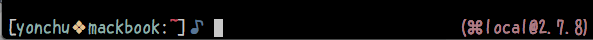

# zsh-python-prompt

Display pyhton version and virtualenv name in zsh prompt.



## Sample

Python: ``/usr/bin/python``

```console
[user@host(system@2.7.5)]$
```

Python: ``/usr/local/bin/python``

```console
[user@host(local@2.7.8)]$
```

Python: Use pyenv (``/usr/local/bin/python``)

```console
[user@host(⌘local@2.7.8)]$ pyenv version
system (set by /Users/user/.pyenv/version)
```

Python: Use pyenv (``/Users/user/.pyenv/versions/2.7.8/bin/python2.7``)

```console
[user@host(⌘@2.7.8)]$ pyenv version
2.7.8 (set by /Users/user/.pyenv/version)
```

Python: Use pyenv (``/Users/user/.pyenv/versions/pyenv_t/bin/python``)

```console
[user@host(⌘pyenv_test@2.7.8)]$ pyenv version
pyenv_test (set by /Users/user/hoge/fuga/pyenv_test/.python-version)
```

## Installation

1.Source ``zsh-python-prompt/zshrc.zsh`` file.

```sh
source /path/to/zsh-python-prompt/zshrc.zsh
```

2.Set the environmental variable ``$ZSH_PYTHON_PROMPT`` to ``PROMPT`` or ``RPROMPT``.

```sh
PROMPT+='$ZSH_PYTHON_PROMPT'
```

3.Enable environmental variables in ``PROMPT``.

```sh
setopt prompt_subst
```

## Customize

Change pyenv symbol.

```sh
zstyle ':zsh-python-prompt:pyenv:' symbol '⌘'
```

## License

[MIT License](LICENSE)
